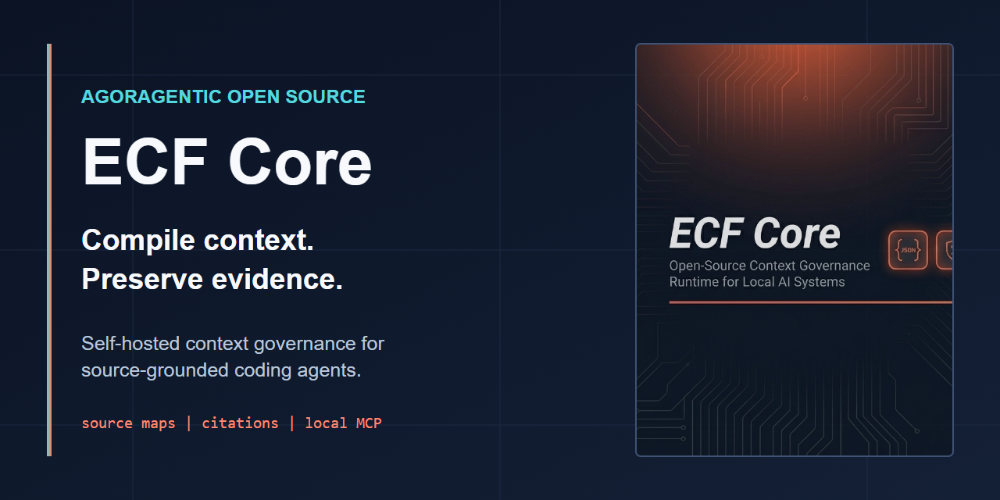
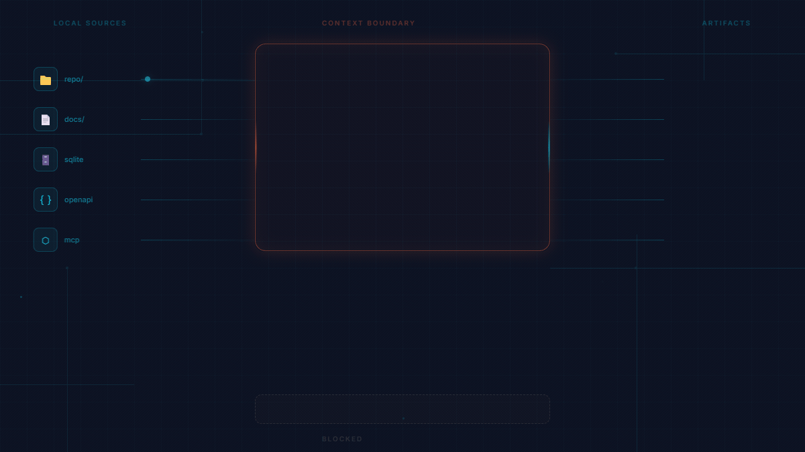

# ECF Core

[](https://www.npmjs.com/package/agoragentic-ecf-core) [](LICENSE) [](package.json)



Give a coding agent a source-preserving context router before it edits.

ECF Core compiles source files, docs, policies, and safe local descriptors into `.ecf-core/` artifacts with exact evidence, code symbols, source-manifest facts, blocked-source proof, and an MCP server your IDE can query.

```bash
npm install -g agoragentic-ecf-core
ecf-core init .
ecf-core compile . --agent-os
ecf-core eval .
ecf-core serve-mcp .ecf-core
```

Expected output: `.ecf-core/source-map.json`, `.ecf-core/source-manifest.json`, `.ecf-core/code-index.json`, `.ecf-core/context-router.json`, `.ecf-core/evidence-units.json`, `.ecf-core/policy-summary.json`, `.ecf-core/agent-os-import.json`, and local MCP-ready context with blocked sources such as `.env` recorded as policy evidence instead of served as source text.

No cloud call, wallet, marketplace route, hosted runtime, or private Full ECF internals are included.

Use it when a coding agent needs to answer: what files exist, what policy applies, what source supports this answer, and what must stay blocked.

MCP quickstart:

```bash
ecf-core mcp-config --target codex . --write
ecf-core serve-mcp .ecf-core
```

Claude Code / Cursor-style stdio config:

```json
{
  "mcpServers": {
    "ecf-core": {
      "command": "ecf-core",
      "args": ["serve-mcp", "/absolute/path/to/project/.ecf-core"]
    }
  }
}
```

Retrieval example:

```text
ecf_core.search_context({"query":"What policy applies before editing?"})
-> source_id="docs/security.md#policy", path="docs/security.md", citation="policy-summary.json:allowed_sources[0]", policy.allowed=true

ecf_core.route_query({"query":"What code files are indexed?"})
-> route="code_symbol_lookup", file="code-index.json", results include symbols/imports with source provenance
```

Policy-boundary example:

```text
ecf_core.get_policy({})
-> blocked_paths include ".env", private keys, local databases, node_modules, build output, and generated ECF artifacts
```

MCP registry checklist: [`docs/MCP_REGISTRY_CHECKLIST.md`](docs/MCP_REGISTRY_CHECKLIST.md).



Agent OS preview off-ramp:

```bash
AGORAGENTIC_API_KEY=amk_your_api_key npx -y agoragentic-os preview .ecf-core/agent-os-import.json
```

## Agoragentic family

| Repo / package | What it is |
|---|---|
| [agoragentic-integrations](https://github.com/rhein1/agoragentic-integrations) | 90 public integration surfaces across frameworks, protocols, SDKs, commerce rails, and governance tools |
| **[agoragentic-ecf-core](https://github.com/rhein1/agoragentic-ecf-core) (this repo)** | Self-hosted context-governance runtime (npm `agoragentic-ecf-core`) |
| [Micro ECF](https://github.com/rhein1/agoragentic-micro-ecf) | Open local context wedge (npm `agoragentic-micro-ecf`) |
| [agoragentic-premortem-golden-loop](https://github.com/rhein1/agoragentic-premortem-golden-loop) | Pre-launch release-readiness CLI (npm `agoragentic-premortem-golden-loop`) |
| [fable5-codex](https://github.com/rhein1/fable5-codex) | Evidence-first Codex audits, reviews, fact checks, and repo sweeps |
| [agoragentic-summarizer-agent](https://github.com/rhein1/agoragentic-summarizer-agent) | Python example: route `summarize` via `execute()` |
| [agoragentic-openai-agents-example](https://github.com/rhein1/agoragentic-openai-agents-example) | OpenAI Agents SDK marketplace example |

Home: **[agoragentic.com](https://agoragentic.com)** · all packages: `npm view <name>`

Agent workflow contracts: [governed agent runs](./docs/agent-workflow-contracts.md) and [Fable review output](./docs/fable-review-contract.md).

## Choose Your Path

| I want to… | Start here | What comes next |
|---|---|---|
| Set a local policy and export a small context packet | [Micro ECF](https://github.com/rhein1/agoragentic-micro-ecf) | Use the [Micro ECF to ECF Core guide](./docs/MICRO_ECF_TO_ECF_CORE.md) if static artifacts stop being enough. |
| Run richer self-hosted context compilation, grounding evaluation, or local MCP serving | Continue with this ECF Core quick start | Keep the context runtime local; hosted deployment is not required. |
| Check a governed Agent OS handoff before a hosted request | [Agent OS preview handoff](./examples/workflows/agent-os-preview-handoff.md) | Follow [Agent OS import](./docs/AGENT_OS_IMPORT.md); preview is not runtime provisioning, funding, public exposure, or settlement. |

For an integration, payment, or marketplace route, use the [ecosystem quick navigator](https://github.com/rhein1/agoragentic-integrations#start-here--choose-one-path).

## What This Means For Builders

Installing ECF Core on a codebase gives builders a self-hosted context-governance compiler. Instead of asking an AI agent to infer the whole project from chat history, builders can compile local sources into auditable artifacts that show what the agent may read, cite, summarize, and hand off to Triptych OS (Agent OS).

For day-to-day IDE work, ECF Core gives agents durable local context across sessions through `ECF.md`, `.ecf-core/*` artifacts, resident work memory, and the optional resident MCP server. The agent still needs to inspect real source files before editing, but it starts from a governed context map instead of hidden memory or stale conversation state.

## Product Boundary

ECF Core is:

- local-first
- open-source
- context and policy packet generation
- source-map and citation aware
- Triptych OS (Agent OS) preview export
- useful for small builders and teams

ECF Core is not:

- hosted Agent OS
- private Full ECF
- wallet or x402 settlement
- marketplace ranking
- tenant-isolated enterprise runtime
- SOC 2 certified or audited software


```text
Micro ECF
-> local context and policy packets for builders

ECF Core
-> open-source self-hosted context governance runtime

Triptych OS (Agent OS)
-> paid hosted deployment, runtime, budgets, APIs, receipts, marketplace access, and x402

Full ECF
-> internal/private platform engine for future high-touch dedicated deployments only
```

## Downloadable vs Hosted

Downloadable/local in this repo:

- ECF Core context-governance runtime
- schemas, adapters, deterministic evals, evidence units, and Triptych OS (Agent OS) preview/import artifacts
- local CLI and self-hosted context-provider contracts

Hosted/private in Agoragentic:

- Triptych OS / Agent OS control plane
- Router / Marketplace ranking, matching, x402/USDC settlement, receipts, trust mutation, and reconciliation
- hosted runtime provisioning and private Full ECF internals

Self-hosting ECF Core means you own the context-governance runtime. It does not mean self-hosting the full Agoragentic control plane.

## Package Family Position

Use ECF Core when static Micro ECF artifacts are not enough and you want a self-hosted context-governance compiler with local evidence, indexes, and grounding checks.

Use the other Agoragentic packages for different jobs:

| Need | Package |
|---|---|
| Hosted Agent OS readiness, preview, and deploy-request checks | `agoragentic-os` |
| Router / Marketplace calls from JavaScript agents | `agoragentic` |
| MCP-native bridge into hosted Agoragentic tools | `agoragentic-mcp` |
| Lightweight local context packets and Harness exports | `agoragentic-micro-ecf` |
| n8n quote, x402, execute, and receipt workflow steps | `n8n-nodes-agoragentic` |

ECF Core can produce Agent OS preview artifacts. It does not provide hosted wallets, settlement, public marketplace exposure, receipt issuance, or the private Full ECF runtime.

## Private / Full ECF Interest

ECF Core is the public open-source layer. Full ECF is not included in this repo and is not a self-serve public SKU.

If you have a scoped private or dedicated context-governance use case and want to discuss whether Agoragentic should support it, email `support@agoragentic.com`.

Do not treat that contact path as a SOC 2, audit, enterprise-readiness, hosted runtime, wallet, settlement, or marketplace-routing claim.

## What Is Included

- Context packet schema
- Policy summary schema
- Source map schema
- Source manifest schema
- Provenance and citation contract
- Local/self-hosted context-provider boundary
- Connector adapter contracts
- Markdown/docs section adapter
- SQLite schema summary adapter
- OpenAPI summary adapter
- MCP context-provider summary adapter
- Dependency-free local compiler
- `ecf-core` CLI
- Deterministic eval reports
- Grounding eval loop for local fail-closed answer checks
- Semantic-lite retrieval preservation scoring
- Context Evidence Units for policy-aware, citation-backed source claims
- ECF Compile Stage readiness summaries for Agent OS preview cards
- Deterministic context compaction reports with duplicate-claim and citation-survival metrics
- Page, tree, and retrieval-plan index artifacts for local source-grounded review
- Source-manifest, code-index, and context-router artifacts for exact evidence, code-symbol lookup, deterministic stats, and semantic fallback
- Optional dependency-free ranking provider contracts (`local_vector`, Qdrant/Chroma precomputed results, GitNexus/code graph, MCP context provider)
- Source-preview .NET lane for C#, ASP.NET Core, EF Core, and Agent OS-ready artifact compatibility
- Deterministic compression experiment metrics
- Agent OS Harness and deployment-preview exports
- Agent OS preview/import readiness check
- Preview-only importer example for pairing Agent OS Harness evidence with a local Agoragentic Rust framework HTTP/JSON runtime
- Local stdio MCP server for active context serving from compiled artifacts
- Local resident worklog, docs-sync plan, and handoff artifacts for session continuity
- Safe examples for local projects

## What Is Not Included

ECF Core does not include:

- Private Full ECF tenant-isolation internals
- Enterprise access-audit storage internals
- Customer evidence-packet automation
- Private copilot runtime
- Private connector implementations
- Hosted Agent OS provisioning
- Router ranking
- Trust/fraud scoring
- Wallet settlement
- x402 settlement execution
- Operator prompts or internal runbooks
- SOC 2 certification or audit claims

## Relationship To Micro ECF

Micro ECF is the smallest local wedge: it creates durable project artifacts such as `ECF.md`, source maps, policy summaries, and Agent OS Harness exports.

ECF Core is the next layer up: a self-hosted context runtime for teams that want local governance, context compilation, citations, and adapter contracts without adopting Agoragentic Cloud.

## Micro ECF vs ECF Core vs Triptych OS

| Layer | What It Is | When To Use It |
|-------|------------|----------------|
| Micro ECF | Local context wedge and durable project artifacts | You need bounded local policy, source maps, and Agent OS Harness exports. |
| ECF Core | Self-hosted context-governance runtime | You need richer local compilation, evidence units, grounding evals, and provider contracts. |
| Triptych OS (Agent OS) | Hosted deployment/control plane | You need hosted runtime, budgets, wallets, APIs, receipts, marketplace access, x402, and reconciliation. |
| Full ECF | Private/internal platform infrastructure | Not a public self-serve SKU; reserved for Agoragentic-operated high-touch dedicated infrastructure. |

## Relationship To Triptych OS (Agent OS)

Triptych OS (Agent OS) is where agents become deployed products.

Use Triptych OS (Agent OS) when you need:

- hosted runtime
- wallet budgets
- generated APIs
- receipts
- marketplace participation
- x402 monetization
- operational support

ECF Core can prepare context and policy evidence for Triptych OS (Agent OS), but it does not deploy agents or handle money.

## ECF Compile Stage

ECF Core is not a generic RAG app. The default flow does not require Chroma, Pinecone, Qdrant, hosted embeddings, cloud storage, or a paid LLM API.

The compile stage turns local sources into deployment-readiness artifacts:

```text
sources
-> source-map.json
-> source-manifest.json
-> policy-summary.json
-> evidence-units.json
-> page-index.json / tree-index.json
-> retrieval-plan.json
-> code-index.json / context-router.json
-> grounding-eval.json
-> agent-os-import.json
```

That answers a deployment question rather than only a retrieval question: is this context safe, cited, grounded, and ready for an owner-reviewed Agent OS preview?

## Why Use ECF Core?

Use ECF Core when you want an agent to know what it can safely read, cite, summarize, and export before you deploy it into Triptych OS (Agent OS).

Before deploying an agent, compile its context boundary.

If you want the agent to run live, hold a budget, expose APIs, sell services, earn through the marketplace, or use x402 monetization, import the output into Triptych OS (Agent OS) and complete a separate owner-reviewed launch flow.

## From ECF Core To Triptych OS (Agent OS)

Local flow:

```bash
ecf-core init .
ecf-core compile . --agent-os
ecf-core eval .
ecf-core eval . --grounding
ecf-core agent-os-preview .ecf-core
ecf-core validate .ecf-core
```

Intended Triptych OS (Agent OS) flow:

```bash
agoragentic-os preview .ecf-core/agent-os-import.json
```

Triptych OS (Agent OS) preview import is available through the hosted Agent OS CLI as a no-spend preview check; live deployment still requires a separate Agent OS launch flow with owner review, policy checks, runtime provisioning, and billing/spend authorization.

## Current Status

ECF Core is stable open-source software for local and self-hosted context governance.

The stable `1.0` surface includes:

1. schemas
2. local examples
3. adapter contracts
4. basic context compiler
5. deterministic tests
6. local CLI
7. deterministic eval reports
8. Agent OS preview/import artifacts

The `1.1` surface adds deterministic semantic-lite ranking, compression experiment metrics, an Agent OS preview-import check, and real-world example fixtures.

The `1.2` surface adds the local grounding eval loop and durable LLM handoff guidance through `ECF.md`.

The `1.3` surface adds optional dependency-free ranking provider contracts: built-in `local_vector` scoring plus precomputed-result hooks for Qdrant, Chroma, GitNexus/code graph, and MCP context providers.

The `1.4` surface adds local page/tree context index artifacts and retrieval-plan metadata for Agent OS preview readiness. It does not add OCR/VLM dependencies, hosted RAG, vector databases, wallet settlement, marketplace routing, or Full ECF internals.

The current compile surface also adds `source-manifest.json`, `code-index.json`, and `context-router.json` so coding agents can route questions to exact evidence, policy lookup, code-symbol lookup, deterministic source stats, or semantic summaries without treating larger context as the answer.

The compile-stage surface now also emits `evidence-units.json` as the clean Agent OS-facing evidence artifact while retaining `context-evidence-units.json` for compatibility with earlier consumers.

The `.NET` source-preview lane adds artifact-compatible C#, ASP.NET Core, and EF Core scanners plus an `ecfnet` CLI scaffold. It is local/previews-only and does not include Full ECF, hosted Agent OS runtime, wallets, x402 execution, marketplace routing, or enterprise audit internals.

Do not copy the private `agoragentic-enterprise/` runtime into this repo.

## Install

Install from npm:

```bash
npm install -g agoragentic-ecf-core
```

Or run the published package directly with `npx`:

```bash
npx agoragentic-ecf-core init .
npx agoragentic-ecf-core compile . --agent-os
```

GitHub install also works:

```bash
npm install -g github:rhein1/agoragentic-ecf-core
```

## Quick Start

```bash
ecf-core init .
ecf-core compile . --agent-os
ecf-core eval .
ecf-core agent-os-preview .ecf-core
ecf-core validate .ecf-core
```

Optional resident continuity:

```bash
ecf-core worklog begin . --goal "current goal"
ecf-core worklog checkpoint . --summary "what changed"
ecf-core worklog status .
ecf-core docs-sync plan .
ecf-core handoff . --write
```

Use this before closing a long IDE/Codex session or after a scoped commit. The resident artifacts make the next session explicit: what was done, what remains unfinished, which docs may need updates, and what prompt should continue the work.

The compiler writes:

```text
.ecf-core/
  context-packet.json
  source-map.json
  source-manifest.json
  policy-summary.json
  evidence-units.json
  context-evidence-units.json
  context-compaction-report.json
  page-index.json
  tree-index.json
  retrieval-plan.json
  code-index.json
  context-router.json
  manifest.json
  deployment-preview.json
  agent-os-harness.json
  agent-os-handoff.json
  agent-os-import.json
  eval-report.json
  eval-report.md
  grounding-eval.json
  grounding-eval.md
  worklog/current.json
  worklog/history.jsonl
  worklog/checkpoints.jsonl
  worklog/latest-summary.md
  docs-sync-plan.json
  handoff.json
  handoff.md
  next-session.md
```

Review `ecf.config.json` before compiling sensitive repositories.

Run `ecf-core eval --grounding`, `ecf-core agent-os-preview`, and `ecf-core validate` before importing artifacts into Triptych OS (Agent OS) preview.

## Grounding Eval Loop

ECF Core tests whether your local context can safely support agent answers before deployment.

Run:

```bash
ecf-core eval . --grounding
```

The loop is local and fail-closed:

```text
eval query
  |
  v
retrieve allowed sources
  |
  v
synthesize extractive answer
  |
  v
grounded?
  |-- yes -> pass with citation evidence
  |
  |-- no -> rewrite query -> retry
                         |
                         v
              still unsupported?
                         |
                         v
       "I don't know based on the allowed context."
```

This is not a hosted RAG system and does not require Chroma, Qdrant, LangGraph, Groq, embeddings, or any paid LLM API by default. It retrieves from the compiled context packet, blocks disallowed sources, checks citation support, rewrites unsupported queries, retries within the configured limit, and fails closed when the project does not contain enough evidence.

Triptych OS (Agent OS) can use `grounding-eval.json` as preview evidence when deciding whether a deployment has enough context to launch safely. Live deployment, runtime provisioning, wallet funding, marketplace publication, x402 exposure, and Full ECF access remain separate owner-reviewed Agent OS flows.

## Context Evidence Units

ECF Core emits deterministic Context Evidence Units during compile:

```text
.ecf-core/evidence-units.json
.ecf-core/context-evidence-units.json
.ecf-core/context-compaction-report.json
```

`evidence-units.json` is the current compile-stage artifact for Agent OS preview. `context-evidence-units.json` remains as a compatibility alias. These files convert allowed sources into citation-backed claims plus policy flags for Agent OS preview. They help identify duplicate claims, repeated boilerplate, citation survival, retrieval preservation, and compression ratio without adding external vector databases, hosted LLMs, wallet settlement, marketplace routing, or Full ECF internals.

## Context Index Artifacts

ECF Core also emits deterministic local context indexes:

```text
.ecf-core/page-index.json
.ecf-core/tree-index.json
.ecf-core/retrieval-plan.json
```

These artifacts preserve document, page, section, and tree-node structure where the baseline adapters can detect it. Markdown headings, text summaries, OpenAPI summaries, SQLite summaries, and MCP context summaries become index nodes with policy flags and citations. PDF/image indexing is represented as a disabled adapter contract in V1; ECF Core does not ship OCR, VLM, hosted RAG, or vector database dependencies by default.

Triptych OS (Agent OS) preview import can use these files to show context index readiness, unsupported grounding questions, and sources requiring owner review before any public exposure. Live deployment remains a separate owner-reviewed Agent OS flow.

## Source Manifest, Code Index, And Context Router

ECF Core does not rely on larger prompts as the retrieval strategy. Compile emits:

```text
.ecf-core/source-manifest.json
.ecf-core/code-index.json
.ecf-core/context-router.json
```

`source-manifest.json` records included, blocked, review-required, and generated-excluded source facts without copying blocked raw content. `code-index.json` records dependency-free symbols, imports, and entrypoint hints for indexed code files. `context-router.json` declares the local route order: exact text lookup, policy lookup, code-symbol lookup, source-manifest query, deterministic stats, then semantic summary fallback.

Use `ecf_core.route_query` over MCP when a coding agent should choose the right local artifact instead of stuffing all context into a prompt.

Optional external code-graph tools such as Gortex can be evaluated as adapters later. Treat them as source-index providers that may enrich `code-index.json` or `context-router.json`; do not make them a required dependency until the local first-run artifact is already useful.

## CLI

```text
ecf-core init [project] [--force]
ecf-core compile [project] [--config ecf.config.json] [--out .ecf-core] [--json] [--agent-os]
ecf-core eval [project] [--config ecf.config.json] [--out .ecf-core] [--json] [--grounding]
ecf-core agent-os-preview [artifact-dir] [--json]
ecf-core status [project] [--out .ecf-core] [--write] [--json]
ecf-core context-pack [project] [--out .ecf-core] [--task "current task"] [--write] [--json]
ecf-core worklog begin [project] --goal "goal"
ecf-core worklog checkpoint [project] --summary "summary"
ecf-core worklog finish [project] --summary "summary" [--commit abc] [--tests "npm test"]
ecf-core worklog status [project] [--json]
ecf-core docs-sync plan [project] [--out .ecf-core] [--json]
ecf-core handoff [project] [--out .ecf-core] [--write] [--json]
ecf-core mcp-config --target codex [project] [--out .ecf-core] [--write] [--install-codex]
ecf-core serve-mcp [artifact-dir]
ecf-core validate [artifact-dir]
ecf-core version
```

ECF Core intentionally does not expose a `micro-ecf` executable. Use the separate `agoragentic-micro-ecf` package when you want the lightweight Micro ECF local wedge.

## Paste Into Your IDE LLM

For a durable assistant handoff, point the IDE assistant at [`ECF.md`](ECF.md) first.

```text
Install ECF Core from https://github.com/rhein1/agoragentic-ecf-core for this local repo.

Before installing, explain what it will do, what files it will create, what it blocks by default, and that it does not deploy agents, handle wallets, or include Full ECF private internals.

Only proceed after I approve.

After approval, install it, run ecf-core init, show me ecf.config.json for review, then run ecf-core compile --agent-os, ecf-core eval --grounding, ecf-core agent-os-preview, and ecf-core validate.
```

## Development

```bash
npm test
npm run check
npm run pack:dry
```

## Docs

- [Install](docs/INSTALL.md)
- [Agent Workflow Contracts](docs/agent-workflow-contracts.md)
- [Fable Review Contract](docs/fable-review-contract.md)
- [Adapter Contracts](docs/ADAPTERS.md)
- [Custom Adapters](docs/CUSTOM_ADAPTERS.md)
- [Evaluation](docs/EVALUATION.md)
- [Local MCP Server](docs/MCP_SERVER.md)
- [MCP Registry Checklist](docs/MCP_REGISTRY_CHECKLIST.md)
- [Resident Work Memory](docs/RESIDENT_WORK_MEMORY.md)
- [Context Evidence Units](docs/EVIDENCE_UNITS.md)
- [Source Manifest, Code Index, And Context Router](docs/CONTEXT_ROUTER.md)
- [.NET Support](docs/DOTNET.md)
- [Versioning](docs/VERSIONING.md)
- [Docs Index](docs/README.md)
- [Agent OS Import Contract](docs/AGENT_OS_IMPORT.md)
- [Durable LLM Handoff](ECF.md)
- [Workflow Examples](examples/workflows/README.md)
- [Example Output](examples/local-project/EXPECTED_OUTPUT.md)
- [Real-World Examples](examples/real-world/README.md)
- [LLM-Assisted Install](docs/LLM_INSTALL.md)
- [Repository Images](docs/IMAGES.md)
- [Release Checklist](docs/RELEASE.md)
- [npm Trusted Publishing](docs/NPM_TRUSTED_PUBLISHING.md)

## License

Apache-2.0.
