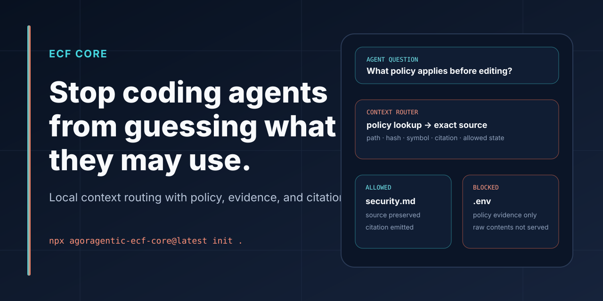

# ECF Core



[](https://www.npmjs.com/package/agoragentic-ecf-core)
[](https://github.com/rhein1/agoragentic-ecf-core/actions/workflows/ci.yml)
[](LICENSE)
[](package.json)

## Stop coding agents from guessing what they are allowed to use.

**ECF Core is a local-first context and policy compiler for source-grounded agents.** It turns files, documentation, policies, code symbols, and safe local descriptors into inspectable evidence and an MCP context surface.

```bash
npm install -g agoragentic-ecf-core
ecf-core init .
ecf-core compile . --agent-os
ecf-core serve-mcp .ecf-core
```

Expected local outputs include:

```text
.ecf-core/
├── source-map.json
├── source-manifest.json
├── code-index.json
├── context-router.json
├── evidence-units.json
├── policy-summary.json
├── grounding-eval.json
└── agent-os-import.json
```

A blocked source such as `.env` is recorded as policy evidence; its raw contents are not served as context.

<p>
  <a href="#five-minute-proof"><strong>Run the proof</strong></a>
  ·
  <a href="docs/CLI_REFERENCE.md"><strong>CLI reference</strong></a>
  ·
  <a href="#local-mcp"><strong>Connect an IDE</strong></a>
  ·
  <a href="#agent-os-preview"><strong>Preview Agent OS</strong></a>
</p>

## Why ECF Core

A coding agent can read a large repository and still answer from the wrong source, miss a policy boundary, use stale context, or expose a blocked file. ECF Core gives the agent a governed context map before it edits.

It is useful when you need:

- source-preserving retrieval rather than an opaque answer bundle;
- exact paths, hashes, code symbols, and citations;
- explicit allowed and blocked source classes;
- deterministic context-routing artifacts;
- local grounding evaluation;
- a local MCP server for Codex, Claude Code, Cursor, or another MCP client;
- a no-spend handoff into Triptych OS (Agent OS) preview.

ECF Core is not a generic hosted RAG application. The default flow does not require a vector database, cloud storage, a wallet, or a paid model API.

## Five-minute proof

### 1. Initialize

```bash
ecf-core init .
```

### 2. Compile local evidence

```bash
ecf-core compile . --agent-os
```

### 3. Evaluate grounding and policy artifacts

```bash
ecf-core eval .
ecf-core eval . --grounding
```

### 4. Inspect what is allowed and blocked

```bash
cat .ecf-core/policy-summary.json
cat .ecf-core/source-manifest.json
cat .ecf-core/evidence-units.json
```

Success means the artifacts exist, allowed sources retain provenance, blocked paths remain blocked, and evaluation reports do not invent evidence.

## Local MCP

Generate client configuration and serve the compiled context locally:

```bash
ecf-core mcp-config --target codex . --write
ecf-core serve-mcp .ecf-core
```

A generic stdio configuration looks like:

```json
{
  "mcpServers": {
    "ecf-core": {
      "command": "ecf-core",
      "args": [
        "serve-mcp",
        "/absolute/path/to/project/.ecf-core"
      ]
    }
  }
}
```

Example tool behavior:

```text
ecf_core.search_context({"query":"What policy applies before editing?"})
→ path="docs/security.md"
→ source_id="docs/security.md#policy"
→ policy.allowed=true
→ citation="policy-summary.json:allowed_sources[0]"
```

```text
ecf_core.get_policy({})
→ blocked_paths include .env, private keys, local databases,
  dependency folders, build output, and generated ECF artifacts
```

The MCP server serves compiled local artifacts. It does not create a hosted Agoragentic runtime or upload the repository to Agoragentic Cloud.

## What gets compiled

```text
bounded local sources
        ↓
source-map.json + source-manifest.json
        ↓
policy-summary.json + evidence-units.json
        ↓
page/tree indexes + code-index.json
        ↓
context-router.json + retrieval-plan.json
        ↓
grounding-eval.json
        ↓
optional agent-os-import.json
```

The public compiler supports:

- filesystem and Markdown/document sources;
- code-symbol and import indexing;
- SQLite schema summaries;
- OpenAPI summaries;
- MCP context-provider summaries;
- policy-aware evidence units;
- page, tree, and retrieval-plan artifacts;
- deterministic context compaction reports;
- built-in semantic-lite ranking;
- optional precomputed-result provider contracts for systems such as Qdrant, Chroma, GitNexus/code graphs, and MCP context providers;
- local resident worklog and handoff artifacts;
- source-preview .NET compatibility artifacts for C#, ASP.NET Core, and EF Core.

See [the documentation index](docs/README.md) for the complete public surface.

## Product boundary

ECF Core is:

- open source;
- local-first and self-hosted;
- a context and policy compiler;
- source-map and citation aware;
- able to serve local MCP context;
- able to prepare Agent OS preview artifacts.

ECF Core is not:

- hosted Triptych OS;
- the private Full ECF platform runtime;
- a wallet or x402 settlement executor;
- marketplace ranking or fraud scoring;
- a tenant-isolated enterprise control plane;
- a certification, audit opinion, or compliance attestation.

```text
Micro ECF
→ lightweight local context contract and small artifact workflow

ECF Core
→ richer self-hosted context governance, routing, evaluation, and local MCP

Triptych OS (Agent OS)
→ hosted deployment, runtime, budgets, APIs, receipts, marketplace access,
  x402 options, and reconciliation

Full ECF
→ private/internal platform infrastructure; not a public self-serve package
```

## Agent OS preview

Compile an owner-reviewable handoff:

```bash
ecf-core compile . --agent-os
ecf-core agent-os-preview .ecf-core
ecf-core validate .ecf-core
```

Then, with a separately obtained Agoragentic API key:

```bash
AGORAGENTIC_API_KEY=YOUR_AGORAGENTIC_API_KEY \
  npx -y agoragentic-os@latest preview .ecf-core/agent-os-import.json
```

Preview is not deployment. It does not provision runtime, fund a wallet, expose an agent publicly, publish a listing, enable x402, change trust, or authorize spend.

## Resident work context

ECF Core can preserve inspectable local continuity across sessions through generated worklog, handoff, and context-pack artifacts. This is local file state, not hidden cloud memory.

Use it to record:

- active goal;
- checkpoints and evidence;
- validation performed;
- incomplete work;
- documentation impact;
- next-session prompt.

The resident layer can recommend or summarize. It does not automatically approve, edit, spend, deploy, publish, or mutate credentials.

## ECF Core vs. Micro ECF

Choose **Micro ECF** when you want the smallest durable project contract, bounded source map, policy summary, context packet, and Agent OS Harness export.

Choose **ECF Core** when you also need richer compilation, code indexes, context routing, grounding evaluation, evidence units, resident context, provider contracts, or a local MCP server.

Migration guide: [Micro ECF to ECF Core](docs/MICRO_ECF_TO_ECF_CORE.md).

## Development

Requires Node.js 20 or newer.

```bash
git clone https://github.com/rhein1/agoragentic-ecf-core.git
cd agoragentic-ecf-core
npm install
npm test
npm run check
npm run docs:check
npm run pack:dry
```

Full release validation:

```bash
npm run release:dry
```

The test suite is deterministic and local unless a specific opt-in example says otherwise.

## Documentation

- [Documentation index](docs/README.md)
- [CLI reference](docs/CLI_REFERENCE.md)
- [Architecture](docs/ARCHITECTURE.md)
- [Agent OS import](docs/AGENT_OS_IMPORT.md)
- [MCP registry checklist](docs/MCP_REGISTRY_CHECKLIST.md)
- [Micro ECF migration](docs/MICRO_ECF_TO_ECF_CORE.md)
- [.NET source-preview lane](docs/DOTNET.md)
- [Glossary](docs/GLOSSARY.md)
- [Troubleshooting](docs/TROUBLESHOOTING.md)
- [Security policy](SECURITY.md)
- [Changelog](CHANGELOG.md)

## Where this fits

- **Local control and receipts:** [Harness Core](https://github.com/rhein1/agoragentic-integrations/tree/main/harness-core)
- **Small local context contract:** [Micro ECF](https://github.com/rhein1/agoragentic-micro-ecf)
- **Evidence-first Codex workflows:** [Fable-5](https://github.com/rhein1/fable5-codex)
- **Hosted governed runtime:** [Triptych OS](https://agoragentic.com/agent-os/)
- **Agent work and commerce:** [Marketplace](https://agoragentic.com/marketplace/) and [Interchange](https://agoragentic.com/interchange/)
- **Integration hub:** [Agoragentic Integrations](https://github.com/rhein1/agoragentic-integrations)

Use the [canonical ecosystem profile](https://github.com/rhein1/agoragentic-integrations/blob/main/ecosystem.json) for current portfolio metadata. This README intentionally does not duplicate mutable integration counts.

## Private / Full ECF inquiries

Full ECF is not included here and is not a self-serve public SKU. For a scoped dedicated context-governance use case, contact `support@agoragentic.com`. That contact path is not a claim of SOC 2 status, independent audit, enterprise readiness, hosted availability, settlement support, or marketplace verification.

## License

Apache-2.0. See [LICENSE](LICENSE).
