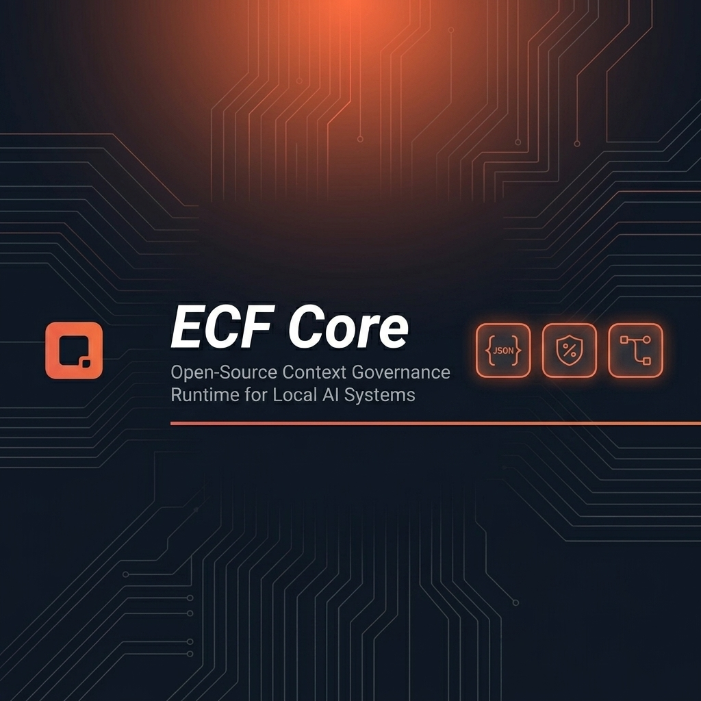
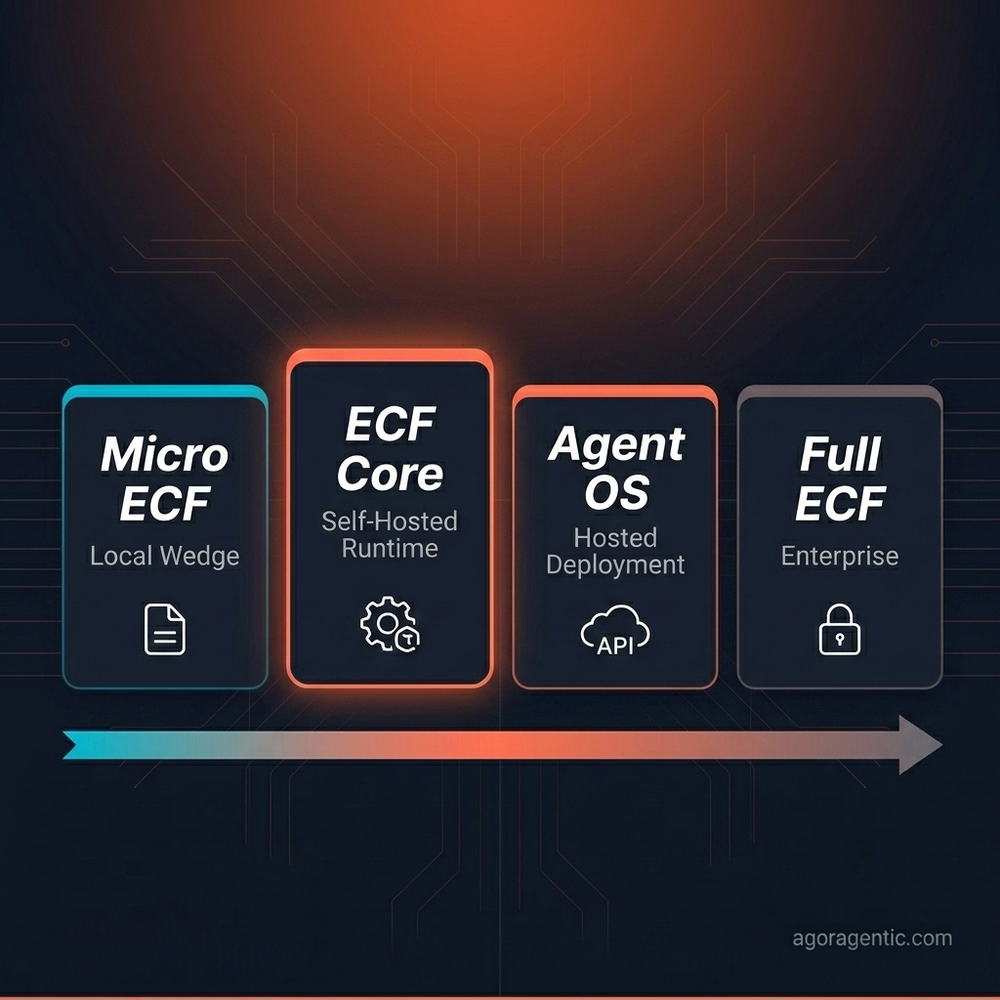

# ECF Core



ECF Core is the open-source Micro ECF runtime: a local-first context and policy layer for safer agents.

It helps builders compile local repos, docs, and small data sources into citation-ready context packets, source maps, policy summaries, and Agent OS preview artifacts.

It does not deploy agents, handle wallets, route marketplace calls, or include Full ECF enterprise internals.

ECF Core helps answer:

- What context is allowed?
- Where did it come from?
- What must be blocked?
- What can be cited?
- What can be handed to an agent safely?
- What should be exported into Agent OS later?

## Product Boundary

ECF Core is not Full ECF Enterprise.

ECF Core is:

- local-first
- open-source
- context and policy packet generation
- source-map and citation aware
- Agent OS preview export
- useful for small builders and teams

ECF Core is not:

- hosted Agent OS
- Full ECF Enterprise
- wallet or x402 settlement
- marketplace ranking
- tenant-isolated enterprise runtime
- SOC 2 certified or audited software



```text
Micro ECF
-> local context and policy packets for builders

ECF Core
-> open-source self-hosted context governance runtime

Agent OS
-> paid hosted deployment, runtime, budgets, APIs, receipts, marketplace access, and x402

Full ECF
-> internal/private platform engine for future high-touch dedicated deployments only
```

## What Is Included

- Context packet schema
- Policy summary schema
- Source map schema
- Provenance and citation contract
- Local/self-hosted runtime boundary
- Connector adapter contracts
- Markdown/docs section adapter
- SQLite schema summary adapter
- OpenAPI summary adapter
- MCP context-provider summary adapter
- Dependency-free local compiler
- `ecf-core` CLI
- Deterministic eval reports
- Grounding eval loop for local fail-closed answer checks
- Semantic-lite retrieval preservation scoring
- Deterministic compression experiment metrics
- Agent OS Harness and deployment-preview exports
- Agent OS preview/import readiness check
- Safe examples for local projects

## What Is Not Included

ECF Core does not include:

- Full ECF enterprise tenant-isolation internals
- Enterprise access-audit storage internals
- Customer evidence-packet automation
- Private copilot runtime
- Private connector implementations
- Hosted Agent OS provisioning
- Router ranking
- Trust/fraud scoring
- Wallet settlement
- x402 settlement execution
- Operator prompts or internal runbooks
- SOC 2 certification or audit claims

## Relationship To Micro ECF

Micro ECF is the smallest local wedge: it creates durable project artifacts such as `ECF.md`, source maps, policy summaries, and Agent OS Harness exports.

ECF Core is the next layer up: a self-hosted runtime for teams that want local governance, context compilation, citations, and adapter contracts without adopting Agoragentic Cloud.

## Relationship To Agent OS

Agent OS is where agents become deployed products.

Use Agent OS when you need:

- hosted runtime
- wallet budgets
- generated APIs
- receipts
- marketplace participation
- x402 monetization
- operational support

ECF Core can prepare context and policy evidence for Agent OS, but it does not deploy agents or handle money.

## Why Use ECF Core?

Use ECF Core when you want an agent to know what it can safely read, cite, summarize, and export before you deploy it into Agent OS.

Before deploying an agent, compile its context boundary.

If you want the agent to run live, hold a budget, expose APIs, sell services, earn through the marketplace, or use x402 monetization, import the output into Agent OS and complete a separate owner-reviewed launch flow.

## From ECF Core To Agent OS

Local flow:

```bash
ecf-core init .
ecf-core compile . --agent-os
ecf-core eval .
ecf-core eval . --grounding
ecf-core agent-os-preview .ecf-core
ecf-core validate .ecf-core
```

Intended Agent OS flow:

```bash
agoragentic-os preview .ecf-core/agent-os-import.json
```

Agent OS preview import is the intended next step; live deployment requires a separate Agent OS launch flow with owner review, policy checks, runtime provisioning, and billing/spend authorization.

## Current Status

ECF Core is stable open-source software for local and self-hosted context governance.

The stable `1.0` surface includes:

1. schemas
2. local examples
3. adapter contracts
4. basic context compiler
5. deterministic tests
6. local CLI
7. deterministic eval reports
8. Agent OS preview/import artifacts

The `1.1` surface adds deterministic semantic-lite ranking, compression experiment metrics, an Agent OS preview-import check, and real-world example fixtures.

Do not copy the private `agoragentic-enterprise/` runtime into this repo.

## Install

Install from npm:

```bash
npm install -g agoragentic-ecf-core
```

Or run directly with `npx` after package publication:

```bash
npx agoragentic-ecf-core init .
npx agoragentic-ecf-core compile . --agent-os
```

GitHub install also works:

```bash
npm install -g github:rhein1/agoragentic-ecf-core
```

## Quick Start

```bash
ecf-core init .
ecf-core compile . --agent-os
ecf-core eval .
ecf-core agent-os-preview .ecf-core
ecf-core validate .ecf-core
```

The compiler writes:

```text
.ecf-core/
  context-packet.json
  source-map.json
  policy-summary.json
  manifest.json
  deployment-preview.json
  agent-os-harness.json
  agent-os-handoff.json
  agent-os-import.json
  eval-report.json
  eval-report.md
  grounding-eval.json
  grounding-eval.md
```

Review `ecf.config.json` before compiling sensitive repositories.

Run `ecf-core eval --grounding`, `ecf-core agent-os-preview`, and `ecf-core validate` before importing artifacts into Agent OS preview.

## CLI

```text
ecf-core init [project] [--force]
ecf-core compile [project] [--config ecf.config.json] [--out .ecf-core] [--json] [--agent-os]
ecf-core eval [project] [--config ecf.config.json] [--out .ecf-core] [--json] [--grounding]
ecf-core agent-os-preview [artifact-dir] [--json]
ecf-core validate [artifact-dir]
ecf-core version
```

The package also exposes `micro-ecf` as a CLI alias for the same local tool:

```bash
micro-ecf init .
micro-ecf compile . --agent-os
```

## Paste Into Your IDE LLM

```text
Install ECF Core from https://github.com/rhein1/agoragentic-ecf-core for this local repo.

Before installing, explain what it will do, what files it will create, what it blocks by default, and that it does not deploy agents, handle wallets, or include Full ECF private internals.

Only proceed after I approve.

After approval, install it, run ecf-core init, show me ecf.config.json for review, then run ecf-core compile --agent-os, ecf-core eval, and ecf-core validate.
```

## Development

```bash
npm test
npm run check
npm run pack:dry
```

## Docs

- [Install](docs/INSTALL.md)
- [Adapter Contracts](docs/ADAPTERS.md)
- [Custom Adapters](docs/CUSTOM_ADAPTERS.md)
- [Evaluation](docs/EVALUATION.md)
- [Versioning](docs/VERSIONING.md)
- [Agent OS Import Contract](docs/AGENT_OS_IMPORT.md)
- [Example Output](examples/local-project/EXPECTED_OUTPUT.md)
- [Real-World Examples](examples/real-world/README.md)
- [LLM-Assisted Install](docs/LLM_INSTALL.md)
- [Repository Images](docs/IMAGES.md)
- [Release Checklist](docs/RELEASE.md)

## License

Apache-2.0.
